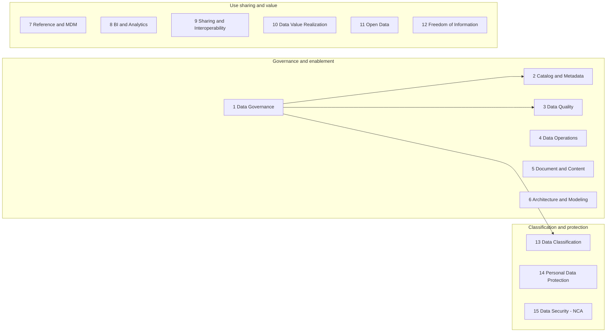

# NDMO domain map (names only)

Official domain names `[C]` — NDMO Standards v1.5, Section 6.  
This is a **name map**, not a statement that Rafid has implemented any domain.

Grouping into the three boxes is a reading aid `[B]`. It is **not** an official NDMO grouping. Official grouping language in the Standards includes themes such as Data Assetization, Data Usage, Data Classification and Availability, and Data Protection `[C]` (Section 6 figure description). If a brief requires official grouping, use the PDF figure, not this diagram.
