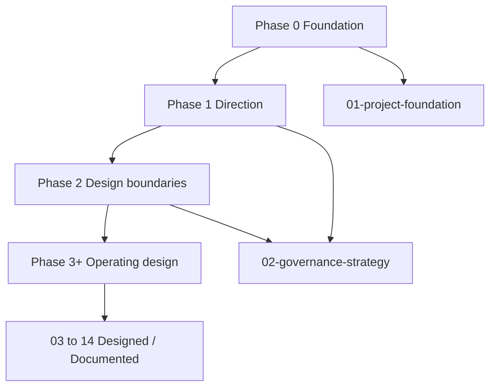

# Phase structure

Conceptual view of the documentation program. Not an NDMO implementation plan.

| Phase | Status |
| --- | --- |
| 0–14 | Designed / Documented |
| Operational implementation | Not claimed |
| Measured performance | Not claimed |
