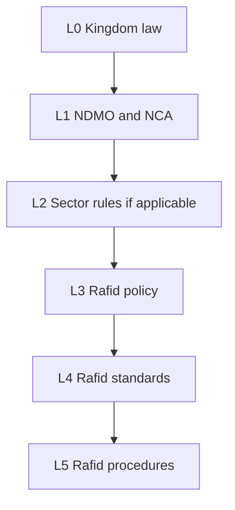

# Policy hierarchy

Layer codes (`L0`–`L5`) are Rafid documentation labels `[B]`, not NDMO control IDs.

Higher layers prevail.

Entity policy (L3) is required by NDMO `DG.2` when that control is executed `[C]`. L3–L5 are **not written** in Phase 0–2.
